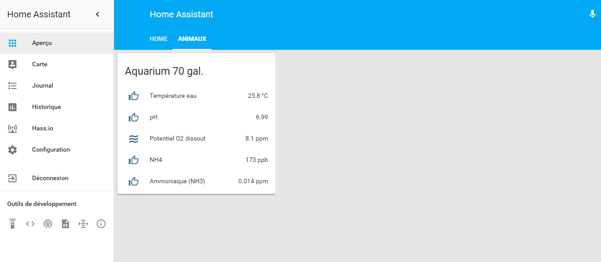

# SENEYE sensor

[Seneye](https://www.seneye.com/) is an aquarium water multi-sensor that decline in 3 versions (at the moment of writing this!).
The readings can include (depending on the model):

- Temperature
- pH
- NH3
- NH4 (ammonia)
- Dissolved O2 potential
- LUX, PAR, Kelvin
- Day/Night cycle
- In/Out water

Documentation on the Seneye api can be found here : [Seneye API documentation](https://api.seneye.com/)

## 0. What it looks like on my HA dashboard

*The thumbs up icons change on value change (low/hi/critical)*



## 1. Get your device ID

Type this in your browser : [https://api.seneye.com/v1/devices?user=***&pwd=***](https://api.seneye.com/v1/devices?user=***&pwd=***)

*Replace the "* * *" by the username and password you are using to login at [Seneye.me](https://www.seneye.me/)*

You should get something like this :
```
<response>
  <device>
    <id>YOUR_DEVICE_ID</id>                                <--- THIS IS THE NUMBER WE NEED!
    <description>YOUR_DEVICE_FRIENDLY_NAME</description>
    <type>3</type>
    <time_diff>0</time_diff>
  </device>
</response>
```

## 2. Create and link ```sensors.yalm```

1. Copy and past this in your configuration.yalm ```sensor: !include sensors.yalm```

   *This is call splitting configuration, more info : [Home Assistant - Splitting configuration](https://home-assistant.io/docs/configuration/splitting_configuration/)*
   
2. Create a sensors.yalm file in the same folder as your configuration.yalm (generaly in the /config folder)

   *This will be the file where you will write the code for all the ```sensor:```*


## 3. Create the sensors

Copy and past the code in my [seneye.yalm](seneye.yalm) file in the ```sensors.yalm``` file you've just created in your HA

#### Code explanations line by line (don't copy that code, copy the one in the [seneye.yalm](seneye.yalm)):

Every sensor is composed of 2 blocs of code

   Bloc 1, fetching the raw value (the one that is to be hide from HA) :

```
- platform: rest
  # don't change that line
  
  resource: https://api.seneye.com/v1/devices/YOUR_DEVICE_ID/exps?user=YOUR_SENEYE_USERNAME&pwd=YOUR_SENEYE_PASSWORD
  # you need to modify this URL with your own Devide ID, Seneye username & password
  
  value_template: '{{ value_json.temperature["curr"] }}'
  # don't change that line, this is where HA fetch the raw value in the Seneye API response
  
  name: "AquariumTemp_raw"
  # this is you personal name for the RAW sensor... but you should hide that one because it's the raw value
  
  method: GET
  # don't change that line, it's the method use 
  
  unit_of_measurement: "°C"
  # unit of the value, no effect on the fetched value
```

   Block 2, template value (the one that is to be display on HA) :
   
```
- platform: template
  # don't change that line
  
  sensors:
  # don't change that line
  
    aquarium_t:
    # you can change that line as you want, this is the name of the sensor
    
      friendly_name: "Temperature"
      # you can change that line as you want, this is the name of the sensor that you will see in HA
      
      unit_of_measurement: '°C'
      # unit of the value, no effect on the fetched value. This is the unit you will see in HA
      
      value_template: '{{ (states.sensor.aquariumtemp_raw.state | float) }}'
      # don't change that line (float is use to keep the decimals, round(0) is used to remove all or some decimals, (0) is for no decimal
      
      icon_template: 'mdi:arrow-down-bold-circlemdi:arrow-down-bold-circle-outlinemdi:thumb-up-outlinemdi:arrow-up-bold-circlemdi:arrow-up-bold-circle-outlinemdi:sync-alert'
      # remove that line if you only want the value (no conditional icon)... will explain this in the Icon Template section
```
### 3.1 The ```icon_template``` code line

That line will dynamically change the icon in front of the sensor's name/value in HA according to the value of that sensor, just remove it if you don't want that!

Example with the water temperature sensor

```
icon_template: 'mdi:arrow-down-bold-circlemdi:arrow-down-bold-circle-outlinemdi:thumb-up-outlinemdi:arrow-up-bold-circlemdi:arrow-up-bold-circle-outlinemdi:sync-alert'
```

In a more readable way...
```
icon_template: 
'
mdi:arrow-down-bold-circle

mdi:arrow-down-bold-circle-outline

mdi:thumb-up-outline

mdi:arrow-up-bold-circle

mdi:arrow-up-bold-circle-outline

mdi:sync-alert
'
```

In words...
```
If the water temperature is < or = to 22
Show that icon
Else if water temperature is.........
...
Else
Show that icon
End if
```
My actual value for my Aquarium water temperature are :

- Normal : 24.1 - 25.9
- Out : 22.1 - 24.0 and 26.0 - 27.9
- Critical : <= 22 and >= 28

You can change the icon as you want by picking any icon on [Material Design Icons](https://materialdesignicons.com/) and simply put ```mdi:``` in front of the name of the icon

## 4. Creating a group to show it as a card

If you've already have a ```groups.yalm``` go to 4.2

### 4.1 Create and link ```groups.yalm```

1. Copy and past this in your configuration.yalm ```group: !include groups.yalm```

   *This is call splitting configuration, more info : [Home Assistant - Splitting configuration](https://home-assistant.io/docs/configuration/splitting_configuration/)*
   
2. Create a groups.yalm file in the same folder as your configuration.yalm (generaly in the /config folder)

   *This will be the file where you will write the code for all the ```group:```*
   
 ### 4.2 Create the group
 
 Copy and past that code in the ```groups.yalm``` file you've just created in your HA
```
Aquarium:
    name: My aquarium
    entities:
      - sensor.aquarium_t
      - sensor.aquarium_ph
      - sensor.aquarium_o2
      - sensor.aquarium_nh4
      - sensor.aquarium_ammonia
```

 #### Code explanations line by line (don't copy that code)
```
Aquarium:
# you can change that line as you want, this is the name of the group

    name: My aquarium
    # you can change that line as you want, this is the name of the group you will see in HA
    
    entities:
    # don't change that line
    
      - sensor.aquarium_t
      - sensor.aquarium_ph
      - sensor.aquarium_o2
      - sensor.aquarium_nh4
      - sensor.aquarium_ammonia
      # those are the sensors you want to see in the group card
      # add lines as you wish (ex.: the light switch of you aquarium...
```
